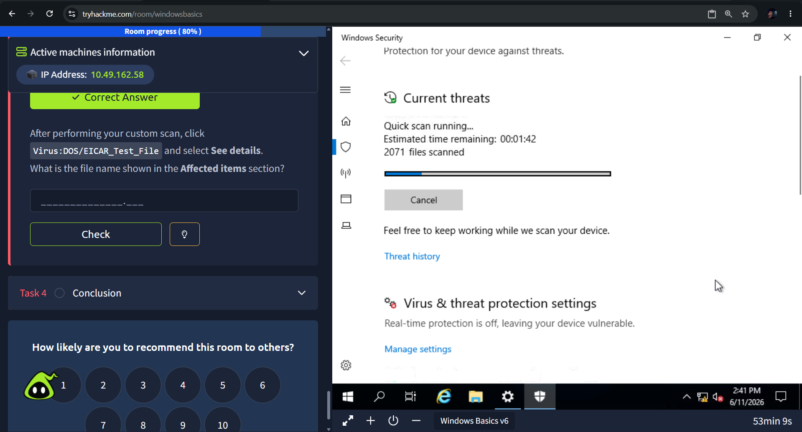

--
# July 18, 2026
Focus: Web Application Architecture — Declarative HTTP Security Headers

-What I did: Analyzed defensive runtime mitigations via server-side HTTP response headers. Evaluated the configuration matrices of Content-Security-Policy (CSP) for cross-site scripting (XSS) containment, Strict-Transport-Security (HSTS) for global TLS enforcement, X-Content-Type-Options (`nosniff`) to suppress browser MIME-type guessing, and Referrer-Policy to prevent credential/URL leakages during external cross-origin redirects.
-Takeaway: Hardcoding strict security headers directly into server configuration blocks provides global, low-overhead browser-enforced barriers against common frontend injection vectors.

# July 17, 2026
Focus: Web Application Architecture — HTTP Response Anatomy & Status Codes

-What I did: Explored the wire-level syntax of HTTP Responses, focusing heavily on the Status Line structure (`HTTP/Version Status_Code Reason_Phrase`). Classified three-digit server response codes into their five primary functional ranges: Informational (1xx), Success (2xx), Redirection (3xx), Client Errors (4xx), and Server Errors (5xx), analyzing standard codes like 200 OK, 301 Moved Permanently, 404 Not Found, and 500 Internal Server Error.
-Takeaway: Memorizing categorical response codes allows for rapid debugging of client-side request malformations versus true server-side system failures during web architecture audits.

# July 16, 2026
Focus: Web Application Architecture — HTTP Responses and Status Codes

-What I did: Concluded the core protocol message analysis on TryHackMe, focusing on HTTP headers, request bodies, and the full HTTP response lifecycle. Deconstructed the response Status Line (`HTTP/Version Status_Code Reason_Phrase`) and mapped out the five functional categories of status codes: Informational (1xx), Success (2xx), Redirection (3xx), Client Errors (4xx), and Server Errors (5xx).
-Takeaway: Mastered the structural taxonomy of web responses (such as 200 OK, 301 Redirect, 404 Not Found, and 500 Internal Server Error) to quickly diagnose upstream infrastructure issues versus client-side payload malformations during audits.

# July 15, 2026
Focus: Web Application Architecture — HTTP Request Anatomy & Methods

-What I did: Deep-dived into the structural components of HTTP Requests, analyzing the Request Line syntax (`METHOD /path HTTP/version`). Evaluated the security parameters of HTTP verbs, noting data leak vectors with GET requests and payload injection surfaces with POST/PUT requests. Examined low-level configuration methods like OPTIONS, TRACE, and CONNECT, and tracked protocol version evolutions from simple text-only HTTP/0.9 to UDP-backed QUIC protocols in HTTP/3.
-Takeaway: Restricting non-essential HTTP methods (like disabling TRACE and OPTIONS on production web servers) reduces information disclosure risk and shrinks the application's overall attack surface.

# July 14, 2026
Focus: Web Application Architecture — HTTP Protocol Message Anatomy

-What I did: Deep-dived into the wire-level syntax of stateless HyperText Transfer Protocol (HTTP) transaction packets. Deconstructed the distinct variations between client Requests and server Responses. Audited the four critical layers of HTTP messages: the start/request line determining operational methods and status returns, the key-value metadata header arrays, the mandatory empty CRLF divider line ($\backslash\text{r}\backslash\text{n}$), and the dynamic body payload segment used for uploading client inputs or returning structural DOM content.
-Takeaway: The empty line in an HTTP message acts as a strict structural divider; understanding this protocol requirement is fundamental for debugging proxy configuration issues and defending against HTTP request smuggling vectors.

# July 13, 2026
Focus: Web Application Architecture — URL Anatomy & Parameter Mechanics

-What I did: Analyzed the complete anatomical structure of a Uniform Resource Locator (URL) and its direct implications on web application security. Traced differences between plaintext HTTP (Port 80) and encrypted HTTPS (Port 443) communication paradigms. Evaluated security threats surrounding domain management, specifically focusing on typosquatting mechanics in phishing flows, and analyzed input validation parameters passed via query strings (`?`) and fragments (`#`).
-Takeaway: Web components driven by query strings and fragments are client-modifiable surfaces; failing to sanitize these values before server-side parsing directly exposes endpoints to injection attacks.

# July 12, 2026
Focus: Introduction to Web Application Architecture

-What I did: Commenced a foundational architectural alignment module on TryHackMe analyzing client-server application layouts. Deconstructed front-end browser runtime components—breaking down HTML document parsing layouts, CSS design rule enforcement systems, and JavaScript asynchronous execution engines. Analyzed backend persistence systems, web routing application servers, and mapped the defensive security posturing of Web Application Firewalls (WAF) filtering malicious Layer 7 HTTP/HTTPS traffic matrices at the network periphery.
-Takeaway: Security engineering requires an exhaustive understanding of web application internals; knowing exactly how front-end code requests state changes from backend data pools allows an analyst to properly map out attack vectors and configure edge protection devices like WAFs.

# July 11, 2026
Focus: Cryptography Basics Module Graduation (100% Completion)

-What I did: Successfully cleared the final challenges of the "Cryptography Basics" room, reaching **100% completion** across Tasks 5 through 7. Deconstructed the operational mechanics dividing Symmetric secret key spaces (AES/DES) from Asymmetric key pairs (RSA/ECC) to manage key distribution safely. Mastered the core mathematical logic driving low-level data masking, analyzing binary Exclusive-OR ($A \oplus B$) transformations and Modulo arithmetic ($\pmod n$) implementations for clock-arithmetic ciphers.
-Takeaway: Cryptography relies heavily on one-way mathematical operations; mastering XOR logic and remainder distributions provides the conceptual basis for analyzing real-world public key infrastructure configurations and encrypted streams.

# July 10, 2026
Focus: Technical Architecture Review & Compliance Planning

-What I did: Attended a technical architecture review session with Google engineering partners. Presented the current DevSecOps pipeline design, evaluating the automated multi-scanner configuration, Terraform infrastructure provisioning, and artifact generation workflows. Documented compliance recommendations and industry best-practice feedback to prepare for future cloud-native deployment phases and enterprise-grade integration patterns.
-Takeaway: Submitting infrastructure pipelines to rigorous peer architectural reviews helps identify hidden configuration edge cases, ensures strict alignment with enterprise cloud security paradigms, and validates documentation clarity.

# July 9, 2026
Focus: Windows Command Line Module Graduation (100% Completion)

-What I did: Completed all final evaluation segments of the "Windows Command Line" track, hitting **100% room completion** across Task 4 (File and Disk Management), Task 5 (Task and Process Management), and Task 6 (Conclusion). Synthesized end-to-end command paradigms including filesystem manipulation (`copy`/`move`), content filtering wildcards (`*`), text-stream chunk parsing (`type`/`more`), granular task telemetry queries (`tasklist /FI`), and strict process termination pipelines (`taskkill /PID`).
-Takeaway: Mastering low-level native terminal mechanics ensures high efficiency when conducting threat-hunting operations, script-based infrastructure audits, or administrative interventions directly inside host operating systems.

# July 8, 2026
Focus: Network Protocols — Subnet Masking, Routing, and Transport Handshakes

-What I did: Advanced through a core network layer tracking module. Audited active network interface configurations via Linux terminal abstractions (`ifconfig` and `ip a s`). Evaluated Classless Inter-Domain Routing (CIDR) allocations, mapping how a 24-bit subnet mask (`255.255.255.0` or `/24`) isolates local hosts while leaving `.0` and `.255` bound to network and broadcast addresses. Memorized RFC 1918 private address ranges (`10.0.0.0/8`, `172.16.0.0/12`, `192.168.0.0/16`) to parse inbound traffic pools. Analyzed Layer 3 router hop selections alongside Transport Layer state engines, mapping out the chronological sequence of the stateful TCP 3-Way Handshake (`SYN` -> `SYN-ACK` -> `ACK`) across valid 16-bit application listening port registers ($1 \le \text{port} \le 65535$).
-Takeaway: Mastering low-level network headers, masking bounds, and stateful socket connections allows an engineer to precisely track down anomalies and spot subtle indicators of compromise across data streams.

# July 7, 2026
Focus: Network Architecture — ISO OSI 7-Layer Reference Model Ingestion

-What I did: Commenced a foundational network engineering module focused on the conceptual ISO OSI reference model framework. Deconstructed the entire 7-layer stack from Layer 1 through Layer 7 using structural mnemonics. Analyzed physical media layers (802.3 Ethernet vs. 802.11 Wi-Fi spectrums), Layer 2 data framing constraints (6-byte hexadecimal MAC structures), Layer 3 network routing protocols (IP, ICMP, IPSec), Layer 4 end-to-end transport control loops (TCP/UDP), Layer 5 application state synchronization (NFS/RPC), Layer 6 presentation formatting parameters (ASCII, Unicode, MIME encoding loops), and Layer 7 end-user system service interfaces (HTTP, DNS, SMTP).
-Takeaway: Deeply learning the exact encapsulation and decapsulation barriers of the OSI model is essential for accurate network triage and configuring targeted protective controls like layer-specific firewalls.

# July 6, 2026
Focus: Windows Process Triage & Lifecycle Management

-What I did: Advanced through the "Windows Command Line" module by analyzing system runtime blocks. Utilized `tasklist` to dump the operating system's active process space. Applied specific string filters via the filter flag (`/FI`) combined with logical evaluation operators (`eq`) to isolate targeted binary profiles (such as `sshd.exe` and `notepad.exe`). Exercised manual administrative override patterns by utilizing `taskkill` coupled with explicit Process ID indicators (`/PID`) to cleanly terminate active application runtime threads.
-Takeaway: Leveraging command-line process auditing tools enables an analyst to bypass standard graphical roadblocks, allowing them to rapidly filter, track down, and terminate unauthorized or hanging background binaries.

# July 5, 2026
Focus: Windows Filesystem Manipulation & Directory Traversal Mechanics

-What I did: Continued the "Windows Command Line" track, moving to directory indexing and filesystem maintenance operations. Mastered operational primitives including absolute directory validation via parameterless `cd` commands, directory listing via `dir` (with hidden systems auditing via `/a` and recursive subdirectory dumps via `/s`), and path visualization via `tree`. Executed object life-cycle mutations using folder provisioning commands (`mkdir`), container removal operations (`rmdir`), standard output dumps (`type`/`more`), relative/absolute item relocation routines (`copy`/`move`), and explicit item destruction processes (`del`/`erase`) integrated with global extension wildcard matching arrays (`*`).
-Takeaway: Navigating a system quickly via the command line using wildcards and recursive flags allows you to audit hidden system configurations and analyze host indicators during a compromise triage session.

# July 4, 2026
Focus: Windows Command Line Networking Infrastructure & Diagnostic Tools

-What I did: Continued the "Windows Command Line" module, expanding technical familiarity with native CLI networking utilities. Evaluated network interface configurations using `ipconfig` and `ipconfig /all` to parse system metrics (IPv4 address, subnet mask, default gateway, lease duration, and active DNS name servers). Performed network layer diagnostics using `ping` (ICMP requests) and `tracert` (TTL trace tracking across public transit gateways). Mastered endpoint socket verification by testing `nslookup` domain record querying alongside advanced `netstat -abon` process mapping to link active TCP sockets directly to their execution Process IDs (PIDs) and system binary names like `sshd.exe`.
-Takeaway: Shifting endpoint auditing from heavy graphical wizards to high-verbosity CLI commands enables rapid administrative reconnaissance and lets you safely inspect open ports or process ownership during incident handling.

# July 3, 2026
Focus: Active Directory Baseline & Windows Command Line Information Gathering

-What I did: Continued parallel tracks within the Windows security space. Maintained foundational Active Directory concepts at 33% room completion. Concurrently initiated the "Windows Command Line" module, achieving 27% progress by completing Task 1 (Introduction) and Task 2 (Basic System Information). Ran core administrative command-line utilities including `hostname`, `systeminfo`, and native environment variables to profile host architectures, software build details, and OS identifiers.
-Takeaway: Command-line system profiling is the first step in defensive auditing and reconnaissance, revealing key endpoint properties without relying on heavy graphical user interfaces.
Focus: Centralized Configuration Loader, Secret Decoupling & Enrichment API Mapping

-What I did: Built out the foundation of SentinelX's configuration architecture by implementing a decoupled, modular initialization pattern (`config.yaml` + `.env` + `config/loader.py`). Structured `.env.example` to separate database variables (`MONGODB_URI`) and integration hooks, including Threat Intelligence API schemas (AbuseIPDB, AlienVault) and Enrichment APIs (VirusTotal, Shodan). Provisioned global app metadata parameters inside `config.yaml` using Python's `pyyaml` library handled via `pyproject.toml` dependency management.
-Takeaway: Decoupling application settings from volatile cryptographic token keys protects the engineering baseline, controls configuration drift, and blocks credential leaks in remote code repositories.

# July 2, 2026
Focus: Active Directory Privilege Escalation Exercises & Object Delegation Tracking

-What I did: Advanced through Task 4 of the "Active Directory Basics" module on TryHackMe. Conducted a localized credential exploitation loop inside a remote desktop (RDP) lab session; used an elevated session via `phillip`'s account to run a password manipulation command in PowerShell, successfully taking over `sophie`'s profile to harvest a hidden flag from her desktop directory (`THM{thanks_for_contacting_support}`). Investigated the architectural design of Active Directory Object **Delegation**, exploring how permissions are distributed securely across Organizational Units (OUs) without relying on over-privileged group memberships.
-Takeaway: Exploiting domain configurations requires understanding target access vectors; configuring granular AD delegation properties minimizes risk by preventing privilege creeping across administrative domains.

# July 1, 2026
Focus: Active Directory Architecture & Windows Domain Infrastructure

-What I did: Commenced the "Active Directory Basics" room within the Cyber Security 101 pathway, reaching 33% room completion. Finalized the foundational modules by clearing Task 1 (Introduction), Task 2 (Windows Domains), and Task 3 (Active Directory). Studied the core operational differences between a standard standalone Windows Workgroup configuration and a centralized Windows Domain architecture. Explored how Active Directory serves as a centralized directory service to manage authentication, objects, and permissions across an entire enterprise network.
-Takeaway: Shifting from local machine account management to a domain structure introduces centralized identity verification via Domain Controllers. Understanding this distinction is fundamental for securing enterprise endpoints and spotting lateral movement tactics.

# June 30, 2026
Focus: Finalizing Windows Security Suite & Living Off the Land (LotL) Vectors

-What I did: Officially completed the "Windows Fundamentals Part 3" module on TryHackMe. Analyzed enterprise security mechanisms including the Antimalware Scan Interface (AMSI) for de-obfuscating script payloads at execution time, and Credential Guard for using virtualization-based security (VBS) to isolate LSASS memory segments. Investigated the offensive operational paradigm known as **Living Off the Land (LotL)**, reviewing how adversaries deploy dual-use native binaries like `wmic.exe`, `powershell.exe`, or `vssadmin.exe` to execute unmonitored scripts and avoid signature detection tools.
-Takeaway: Defensive engineering requires understanding how built-in, trusted system tools can be weaponized by threat actors to quietly conduct enumeration and maintain host persistence.

# June 29, 2026
Focus: Windows Defender Signaling, Threat Mitigation Baselines & Firewall Profiles

-What I did: Advanced through Tasks 3, 4, and 5 of the "Windows Fundamentals Part 3" module on TryHackMe. Evaluated the built-in Windows Security health taxonomy (Green/Yellow/Red status signals) to isolate critical system warnings. Triage-audited a target instance to identify a severe security exposure where the native antivirus engine's **Real-time protection** mechanism had been disabled. Analyzed Windows Defender Firewall boundary profiles, mapping untrusted transit layers (such as airport or coffee shop Wi-Fi access points) directly to the restrictive default **Public network** profile to block unauthorized inbound probes.
-Takeaway: Dissecting native endpoint telemetry and understanding firewall profile switching behavior is fundamental for validating host security postures and verifying that active endpoint protection controls are functional.

# June 28, 2026
Focus: Windows Fundamentals Part 3 – Patch Management & Native Defensive Suites

-What I did: Commenced "Windows Fundamentals Part 3" on TryHackMe, completing the initial layout and reaching the 30% room progress milestone. Spawned the interactive lab environment using an active AttackBox loop to bridge communication with dual remote Windows target instances (`10.48.165.160` and `10.48.181.213`). Successfully cleared Task 2 (Windows Updates) by studying how the OS schedules cryptographic hotfixes and system security patches, and Task 3 (Windows Security) by auditing real-time native threat defense baselines and Windows Defender mitigation suites.
-Takeaway: Monitoring patch levels and native defensive parameters ensures an environment is protected against known CVE exploits; analyzing these built-in systems provides a framework for recognizing anomalous process behavior.

# June 27, 2026
Focus: Windows Registry Architecture & System Configuration Hives

-What I did: Explored Windows system configuration mechanics on TryHackMe by analyzing the Windows Registry structure. Handled the Registry Editor (`regedit`) to understand the centralized hierarchical database that the operating system constantly references at runtime. Analyzed how data is distributed across hive structures to track individual user profile environments, application configurations, file type extension mappings, system hardware manifests, and active hardware communication ports.
-Takeaway: The Registry is the core state database of a Windows machine; understanding how to navigate keys and values is vital for identifying advanced persistence mechanisms, like malicious autorun modifications, during threat hunting.

# June 26, 2026
Focus: Live System Resource Monitoring & Administrative CLI Diagnostics

-What I did: Continued tracking Windows administrative infrastructure tools via TryHackMe. Dissected Resource Monitor (`resmon.exe`) across its four core structural telemetry sections: CPU scheduling, Memory commitment, Disk I/O operations, and Network bandwidth consumption. Audited live process trees, traced active file handle allocations, and mapped deadlocked application states. Switched to Command Prompt (`cmd.exe`) primitives to parse baseline host variables (`hostname`, `whoami`), manipulate network interface details (`ipconfig /?`), analyze socket connection matrices (`netstat`), and query local domain configurations using sub-command wrappers via `net help user` and `net help localgroup`.
-Takeaway: Combining visual hardware mapping trackers with raw command-line utility configurations allows an administrator to quickly spot hidden execution scripts, unprivileged service additions, or suspicious outbound sockets.

# June 25, 2026
Focus: Windows Administration Frameworks, UAC Isolation & System Telemetry Auditing

-What I did: Successfully concluded the "Windows Fundamentals Part 2" room on TryHackMe. Deconstructed User Account Control (UAC) security tiers, mapping out execution parameters for the four base alert slider levels (*Always Notify* down to *Never Notify*) and validating the role of Secure Desktop dimming against prompt interception. Navigated the complete `compmgmt.msc` console to audit System Tools (Task Scheduler automation rules, Event Viewer 3-pane logs, administrative hidden network shares `C$` and `ADMIN$`), Storage (Disk Management volume partitioning), and Services (Startup configurations, binary paths, and WMI/WMIC PowerShell abstraction behaviors).
-Takeaway: Dissecting administrative snap-ins like Event Viewer and local service configurations provides the essential baseline needed to construct precise threat detection rules and track privilege escalation paths within an enterprise infrastructure.

# June 24, 2026
Focus: Windows Fundamentals Part 2 – System Management Consoles & Multi-OS Interaction

-What I did: Launched "Windows Fundamentals Part 2" on TryHackMe. Deployed an interactive dual-system topology, spawning a Linux AttackBox side-by-side with a remote Windows machine. Navigated administrative system management utilities, executed basic configuration audits across early core tasks, and mapped out system configurations to successfully resolve the first 5 technical orientation questions.
-Takeaway: Interoperating with a remote Windows node from a Linux-based platform mirrors realistic defensive and offensive enterprise conditions; mastering administrative dashboard utilities is key for identifying hidden privilege vectors or misconfigured services.

# June 23, 2026
Focus: Administrative Access Control & UAC Defensive Topologies

-What I did: Officially completed the "Windows Fundamentals 1" module on TryHackMe. Advanced into systemic administrative controls by analyzing User Account Control (UAC) security mechanics. Investigated how Windows maps privilege isolation layers, forcing user processes to execute inside a constrained security context and intercepting unauthorized system-wide operations by mandating explicit cryptographic or administrative confirmation alerts before escalation.
-Takeaway: UAC acts as a primary defense-in-depth barrier against silent privilege elevation; understanding its underlying token architecture is vital for identifying misconfigurations that could allow malicious software to bypass security prompts.

# June 22, 2026
Focus: Windows System Architecture, Permissions & Defensive/Offensive Web Reconnaissance Baseline

-What I did: Fully wrapped up the active interactive components for the "Offensive Security Intro" and "Windows Fundamentals" pathways. Audited adversarial attack vectors by simulating target site directory discovery mapping, locating hidden sub-directories, and exploiting insecure application administrative portals. Shifted to system internals to analyze Windows OS blueprints across Task 4 through Task 6. Deconstructed the structural hierarchy of the Windows File System, parsed the integrity roles of system storage binaries within `C:\Windows\System32`, and mapped default user profile account categories alongside explicit Access Control List (ACL) security permissions.
-Takeaway: Knowing exactly how an attacker maps unlinked pages matches directly with knowing where critical operating system binaries and access permissions live; mastering basic Windows access controls and file structures prevents account privilege escalation and unauthorized path traversal.

 June 21, 2026
Focus: Windows Server Architecture & Operating System Fundamentals

-What I did: Pivoted from premium Linux modules to launch into the "Intro to Windows" core operational track on TryHackMe. Deployed a remote sandboxed Windows Server target environment to analyze the system's foundational layer. Evaluated fundamental operating system components, navigated the graphical file system structures, parsed baseline system details, and completed 6 technical orientation tasks tracking administrative workspace operations.
-Takeaway: Holistic security requires deep dual-OS competency; pivoting between Linux terminal structures and Windows administrative layouts ensures a well-rounded baseline for building cross-platform detection engineering rules.

# June 21, 2026

Focus: Windows Server Architecture & Operating System Fundamentals

-What I did: Pivoted from premium Linux modules to launch into the "Intro to Windows" core operational track on TryHackMe. Deployed a remote sandboxed Windows Server target environment to analyze the system's foundational layer. Evaluated fundamental operating system components, navigated the graphical file system structures, parsed baseline system details, and completed 6 technical orientation tasks tracking administrative workspace operations.
-Takeaway: Holistic security requires deep dual-OS competency; pivoting between Linux terminal structures and Windows administrative layouts ensures a well-rounded baseline for building cross-platform detection engineering rules.

# June 20, 2026
Focus: Advanced Linux Querying & Shell I/O Redirection Operators

-What I did: Advanced through "Linux Fundamentals Part 2" on TryHackMe. Shifted to data pipeline manipulation by mastering text-pattern matching via `grep` and multi-parameter file system indexing using `find`. Evaluated structural control flow and stream diversion redirection operators, utilizing `&` for background process spawning, `&&` for conditional string execution chaining, `>` for destructive standard output overwriting, and `>>` for persistent, non-destructive file appending loops.
-Takeaway: Command-line fluency requires mastering stream redirection and text-filtering tools; utilizing operators like `grep` and `>>` allows a security engineer to automate log analysis and script custom collection pipelines smoothly.

# June 19, 2026
Focus: Linux Fundamentals & System Interaction

-What I did: Commenced the "Intro to Linux" module on TryHackMe. Deployed an interactive Linux Virtual Machine instance to interface directly with the bash terminal interface. Practiced core command-line utility configurations for systemic file navigation and process enumeration, tracking absolute environments with `pwd`, investigating user context with `whoami`, listing structural contents with `ls`, changing branch paths with `cd`, and dumping raw output arrays via `cat`.
-Takeaway: A strong command over Linux system navigation is the absolute foundation for security auditing; defensive engineers must be fully comfortable interacting with raw shells to parse target file structures, analyze logs, and configure services securely.

# June 18, 2026
Focus: Offensive Security Intro & Web Application Reconnaissance

-What I did: Completed the "Offensive Security Intro" practical training module on TryHackMe. Adopted an adversarial engineering mindset to study basic web application target surfaces. Initiated sandboxed deployment labs to execute web-based reconnaissance mapping, directory busting to isolate unlinked hidden administrative pages, and simulated a basic web resource exploit sequence to gain unauthorized access to an exposed application admin portal.
-Takeaway: Effective defense requires an intimate understanding of adversarial methodology; tracking how attackers locate hidden directories and exploit weak administrative interfaces informs better routing isolation, path configurations, and defensive monitoring.

# June 17, 2026
Focus: Hybrid Cryptosystems & Defense-in-Depth Engineering

-What I did: Finalized the foundational Cryptography architectural module on TryHackMe. Deconstructed the real-world execution mechanics of hybrid cryptosystems used in TLS handshakes, analyzing how slow asymmetric primitives (RSA, ECC) are leveraged to negotiate a secure, shared ephemeral key, which is then passed to highly efficient symmetric encryption engines (AES, ChaCha20) for rapid high-volume payload transport. Map-profiled cryptography as a single operational layer within a robust defense-in-depth framework that demands auxiliary monitoring, strong credential patterns, and patch cycles.
-Takeaway: Cryptography is not a single fix-all solution; it ensures confidentiality and structural data integrity at rest and in transit, but it fails unless it is accompanied by safe key management and deep monitoring practices.

# June 16, 2026
Focus: Cryptographic Prerequisites & Symmetric Substitution Ciphers

-What I did: Initiated the foundational Cryptography training module on TryHackMe to study data protection frameworks. Evaluated essential security terms including plaintext inputs, ciphertext transformations, key distribution spaces, and mathematical hashing constraints. Completed hands-on practical decoding exercises by manually and programmatically breaking monoalphabetic symmetric substitution ciphers using the modular shifts of the Caesar Cipher technique.
-Takeaway: Cryptography forms the backbone of data security pipelines; understanding low-level mathematical character shifting and substitution primitives is essential before exploring modern asymmetric frameworks or multi-layered transportation protocols.

# June 15, 2026
Focus: InfoSec Principles & CIA Triad Culmination

-What I did: Concluded the foundational review of the CIA Triad architectural module on TryHackMe. Solidified the precise operational parameters of the core security triad: Confidentiality (restricting data telemetry exposure via encryption matrices and rigid ACLs), Integrity (guaranteeing unmitigated data fidelity utilizing cryptographic hashing routines), and Availability (ensuring non-disrupted platform uptime via load balancing and systemic fault tolerance design patterns).
-Takeaway: Internalizing the strict technical definitions of Confidentiality, Integrity, and Availability establishes the vital, overarching mindset required to model threats and audit modern enterprise networks.

# June 14, 2026
Focus: The CIA Triad & Core Information Security Pillars

-What I did: Completed the "CIA Triad" fundamental foundational training module on TryHackMe. Deep-dived into the baseline pillars of data security: Confidentiality (preventing unauthorized data exposure via mechanisms like encryption and access controls), Integrity (guaranteeing data remains unmodified and authentic using hashing and digital signatures), and Availability (ensuring consistent system and data uptime via redundancy and fault tolerance). Analyzed real-world breach scenarios to identify which specific pillars were compromised during tactical attack vectors.
-Takeaway: Every security policy, architectural constraint, and defensive control engineered across an enterprise infrastructure is explicitly designed to uphold one or more pillars of the CIA Triad; balancing these three constraints is the primary objective of information security frameworks.

# June 13, 2026
Focus: Text Encoding Architectures, Code Points & Serialization Standards

-What I did: Completed the "Data Encoding" architectural training module on TryHackMe. Audited the legacy structural boundaries of 7-bit ASCII systems and analyzed how the modern Unicode consortium abstracts character representation by mapping global, universal code points to cross-linguistic alphabets, technical symbols, and emoji sets. Dissected the byte-serialization mechanics, performance trade-offs, and storage overhead discrepancies between variable-width ($UTF-8$, $UTF-16$) and fixed-width ($UTF-32$) data streams inside network buffers.
-Takeaway: Protocol analysis and deep packet inspections require a granular understanding of serialization wrappers; defensive engineers must distinguish between raw binary markers and encoded unicode arrays to prevent buffer misinterpretations or bypass vulnerabilities.

# June 12, 2026
Focus: Data Representation & Positional Numeral Subsystems

-What I did: Cleared the "Intro to Digital Forensics / Base Systems" architectural training module on TryHackMe. Deconstructed numerical representation paradigms across computer hardware and memory registers, mapping the operational dynamics of Decimal (Base-10), Binary (Base-2), Hexadecimal (Base-16), and Octal (Base-8) counting logic. Analyzed low-level telemetry storage allocations—mapping individual bit/byte boundaries (octets) alongside 24-bit Hex RGB color space combinations ($2^{24} \approx 16.7\text{ million}$).
-Takeaway: Forensic log parsing and network packet analysis require deep agility with base systems, as malicious binaries, protocols, and data structures hide within native hex streams or raw byte signatures.

# June 11, 2026
Focus: Windows Administration & Attack Surface Baselines

-What I did: Completed the "Windows Basics" module on TryHackMe using a Windows Server 2019 lab instance. Explored essential system administration panels, distinguishing between native Settings and legacy Control Panel options, while monitoring live system processes inside Task Manager. Audited underlying security layers including Windows Update status, built-in Windows Security options, and inbound/outbound rules inside Windows Defender Firewall.
-Takeaway: Securing an enterprise endpoint requires mastery over its default OS monitoring interfaces and local firewall rules to quickly spot abnormal processes or unauthorized network traffic patterns.

### Room Completion Verification

# June 10, 2026
Focus: OS Architecture, Execution Spaces & Resource Control

-What I did: Cleared the "Operating Systems Introduction" room on TryHackMe, examining structural asset abstractions, process lifecycle scheduling, and file system management. Analyzed the boundary security divide between privileged Kernel Space (direct device management and system calls) and isolated User Space instances, while mapping out speed and precision trade-offs between GUI environments and CLI workflows.
-Takeaway: Modern computer defense requires an intimate understanding of memory boundary protections; manipulating privileges and tracing user-space tools to kernel-level hooks forms the bedrock of host forensics.

# June 9, 2026
Focus: Cloud Computing Fundamentals & Deployment Architecture

-What I did: Cleared the fundamental Cloud Computing module on TryHackMe, analyzing core deployment models (Public, Private, Hybrid) and service archetypes (IaaS, PaaS, SaaS). Examined the mechanics of virtualized provisioning using AWS EC2 instances, evaluating key architectural benefits including high availability, global reach, elastic scalability, and the operational shift to a shared security and usage-based utility model.

-Takeaway: Cloud computing changes infrastructure design from rigid hardware procurement into elastic, software-defined services, making it essential to understand vendor-specific attack surfaces and the shared responsibility security model.

# June 8, 2026
Focus: Virtualization, Containerization & Infrastructure Isolation

-What I did: Cleared fundamental virtualization and containerization modules on TryHackMe, focusing on how hypervisors map physical hardware boundaries to isolated target machines. Dissected the core architectural differences between standard VMs running independent guest operating systems and lightweight containers sharing the host kernel. Analyzed the implementation of network ports as software-defined entry points routing traffic to containerized daemons, while assessing how virtualization patterns enable secure environment isolation and safe malware detonating workflows.

-Takeaway: Containers optimize resource footprints by sharing the host kernel, whereas hypervisors provide complete system-level isolation necessary for untrusted or volatile security environments.

# June 7, 2026
Focus: Hardware Classifications & Network Attack Surfaces

-What I did: Finished the "Computer Types" room on TryHackMe, analyzing the structural differences between workstations, servers, embedded systems, and IoT devices.

-Takeaway: You can't defend an enterprise network if you don't understand the distinct attack surfaces of its hardware assets.

# May 31, 2026
Focus: Web Protocol Fundamentals & Session Mechanics

-What I did: Completed the web protocols foundation lab, breaking down clear-text HTTP request/response structures against encrypted TLS/SSL communication states in HTTPS. Analyzed structural components of application-layer traffic (GET, POST, PUT, DELETE), header metadata parsing, and server status code classes. Examined raw clear-text traffic profiles to map how session cookies and authorization tokens travel exposed over insecure networks.

-Takeaway: You cannot secure application infrastructure without understanding the stateless nature of HTTP and how sessions are artificially maintained via token headers.